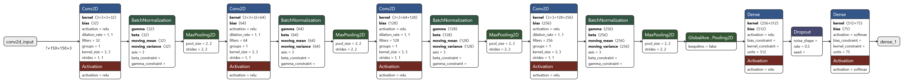
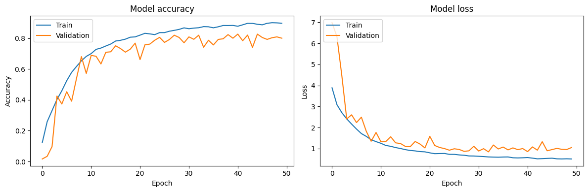

# 🦋 Butterfly Species Classifier

An end-to-end machine learning project that predicts butterfly species from images using deep learning. The project includes a complete ML pipeline, Docker containerization, and deployment on Render.

## 🌟 Features

- Image-based butterfly species classification
- RESTful API for predictions
- Containerized application using Docker
- Complete ML pipeline from data preprocessing to model deployment
- Deployed and accessible on Render
- Available as a pre-built container on GitHub Container Registry

## 📊 Dataset

This project uses the [Butterfly Image Classification Dataset](https://www.kaggle.com/datasets/phucthaiv02/butterfly-image-classification) from Kaggle. The dataset contains:
- 75 different species of butterflies
- High-quality images with various backgrounds and angles
- Properly labeled and categorized data

To use the dataset:
1. Download from Kaggle: [Download Dataset](https://www.kaggle.com/datasets/phucthaiv02/butterfly-image-classification)
2. Accept the dataset terms and conditions
3. Place the downloaded data in the `Butterfly_Classification\Butterfly_Classification\Butterfly_Dataset` directory of the project

## 🛠️ Tech Stack

- **Machine Learning**: TensorFlow
- **Web Framework**: FastAPI
- **Containerization**: Docker
- **Cloud Platform**: Render
- **Programming Language**: Python 3.8+

## 🚀 Quick Start

### Using Pre-built Container

Pull and run the image directly from GitHub Container Registry:

```bash
# Pull the image
docker pull ghcr.io/thevinaysagar/butterfly_species_classification/my-image-name:latest

# Run the container
docker run -p 8000:8000 ghcr.io/thevinaysagar/butterfly_species_classification/my-image-name:latest
```

### Local Development

1. Clone the repository:
```bash
git clone https://github.com/TheVinaySagar/Butterfly.git
cd Butterfly
```

2. Create and activate virtual environment:
```bash
python -m venv venv
source venv/bin/activate  # On Windows: venv\Scripts\activate
```

3. Install dependencies:
```bash
pip install -r requirements.txt
```

4. Run the application:
```bash
uvicorn app.main:app --reload
```

### 🐳 Building Docker Image Locally

1. Build the Docker image:
```bash
docker build -t butterfly-classifier .
```

2. Run the container:
```bash
docker run -p 8000:8000 butterfly-classifier
```

## 📚 API Documentation

Once the application is running, access the API documentation at:
- Swagger UI: `http://localhost:8000/scorefile/`
- Postman: `http://localhost:8000/scorefile/`
- ReDoc: `http://localhost:8000/scorefile/`

### Example API Request

```python
import requests

url = "https://butterflyworld.onrender.com/"
files = {"file": open("butterfly_image.jpg", "rb")}
response = requests.post(url, files=files)
prediction = response.json()
```

## 🔄 ML Pipeline

The project implements a comprehensive machine learning pipeline:

1. Data Collection and Preprocessing
2. Model Training and Validation
3. Model Optimization
4. Inference Pipeline
5. API Integration
6. Deployment Pipeline

## 🧠 Model Architecture

### 1. Deep CNN Model Overview

The model implements a deep Convolutional Neural Network (CNN) architecture specifically designed for butterfly species classification, consisting of four convolutional blocks followed by dense layers for classification.

```
Model: "sequential"
_________________________________________________________________
Layer (type)                Output Shape              Param #   
=================================================================
conv2d (Conv2D)             (None, 148, 148, 32)      896       
batch_normalization         (None, 148, 148, 32)      128       
max_pooling2d              (None, 74, 74, 32)        0         
                                                                 
conv2d_1 (Conv2D)          (None, 72, 72, 64)        18,496     
batch_normalization_1      (None, 72, 72, 64)        256       
max_pooling2d_1           (None, 36, 36, 64)        0         
                                                                 
conv2d_2 (Conv2D)          (None, 34, 34, 128)       73,856     
batch_normalization_2      (None, 34, 34, 128)       512       
max_pooling2d_2           (None, 17, 17, 128)       0         
                                                                 
conv2d_3 (Conv2D)          (None, 15, 15, 256)       295,168    
batch_normalization_3      (None, 15, 15, 256)       1,024      
max_pooling2d_3           (None, 7, 7, 256)         0         
                                                                 
global_average_pooling2d   (None, 256)               0          
dense                     (None, 512)                131,584    
dropout                   (None, 512)                0          
dense_1                   (None, 75)                 38,475     
=================================================================
Total params: 560,395
Trainable params: 559,435
Non-trainable params: 960
```

### Architecture Details

#### Convolutional Blocks

1. **First Block**
   - Conv2D: 32 filters, 3×3 kernel
   - Batch Normalization
   - MaxPooling2D (2×2)
   - Output: 74×74×32

2. **Second Block**
   - Conv2D: 64 filters, 3×3 kernel
   - Batch Normalization
   - MaxPooling2D (2×2)
   - Output: 36×36×64

3. **Third Block**
   - Conv2D: 128 filters, 3×3 kernel
   - Batch Normalization
   - MaxPooling2D (2×2)
   - Output: 17×17×128

4. **Fourth Block**
   - Conv2D: 256 filters, 3×3 kernel
   - Batch Normalization
   - MaxPooling2D (2×2)
   - Output: 7×7×256

#### Classification Head
- Global Average Pooling 2D
- Dense Layer (512 units)
- Dropout Layer (for regularization)
- Output Layer (75 units for species classification)

### Model Properties

- **Total Parameters**: 560,395
- **Trainable Parameters**: 559,435
- **Non-trainable Parameters**: 960
- **Input Shape**: (224,224, 3)
- **Output Classes**: 75 butterfly species

### Key Features

1. **Progressive Feature Extraction**
   - Channel depth increases gradually: 32 → 64 → 128 → 256
   - Spatial dimensions reduce from 148×148 to 7×7

2. **Regularization Techniques**
   - Batch Normalization after each convolution
   - Dropout (before final classification)
   - Global Average Pooling for feature aggregation

3. **Memory Efficiency**
   - Global Average Pooling reduces parameters
   - Systematic reduction in spatial dimensions

### Training Configuration

```python
model.compile(
    optimizer=tf.keras.optimizers.Adam(learning_rate=0.001),
    loss='categorical_crossentropy',
    metrics=['accuracy', tf.keras.metrics.TopKCategoricalAccuracy(k=5)]
)
```

### Data Preprocessing

```python
data_augmentation = Sequential([
    tf.keras.layers.RandomFlip("horizontal"),
    tf.keras.layers.RandomRotation(0.2),
    tf.keras.layers.RandomZoom(0.2),
    tf.keras.layers.RandomBrightness(0.2),
    tf.keras.layers.RandomContrast(0.2),
])
```

### Model Architecture Diagram

<div align="center">
  
</div>

### Loss and Accuracy Curves

<div align="center">
  
</div>

### Performance Metrics

| Metric | Train | Validation |
|--------|--------|------------|
| Accuracy | 89.5% | 80% |
| Loss | 0.530 | 1.04 |


### 2. Deep Transfer Learning Model Overview

The model implements a fine-tuned VGG16 architecture with custom classification layers for butterfly species classification. The model leverages pre-trained weights while customizing the later layers for our specific task.

```
Model: "sequential_6"
_________________________________________________________________
Layer (type)                Output Shape              Param #   
=================================================================
sequential_5 (Sequential)   (None, 224, 224, 3)       0         
                                                                 
vgg16 (Functional)         (None, 7, 7, 512)         14,714,688
                                                                 
flatten_3 (Flatten)        (None, 25088)             0         
                                                                 
dense_6 (Dense)            (None, 512)               12,845,568
                                                                 
dropout_3 (Dropout)        (None, 512)               0         
                                                                 
dense_7 (Dense)            (None, 75)                38,475    
=================================================================
Total params: 27,598,731
Trainable params: 19,963,467
Non-trainable params: 7,635,264
```

### Architecture Details

#### Pre-trained VGG16 Base
- Modified VGG16 architecture with only 5 trainable layers
- First 4 layers frozen to preserve low-level feature extraction
- Output shape: 7×7×512

#### Custom Classification Head
1. **Flatten Layer**
   - Converts 3D feature maps to 1D vector
   - Output: 25,088 features

2. **Dense Layer**
   - 512 units with ReLU activation
   - Trainable weights: 12.8M parameters

3. **Dropout Layer**
   - Rate: 0.5
   - For regularization and preventing overfitting

4. **Output Layer**
   - 75 units (one per butterfly species)
   - Softmax activation

### Model Properties

- **Total Parameters**: 27.6M
- **Trainable Parameters**: 20M
- **Non-trainable Parameters**: 7.6M
- **Input Shape**: (224, 224, 3)
- **Output Classes**: 75 butterfly species

### Key Features

1. **Transfer Learning Strategy**
   - Leverages pre-trained VGG16 weights
   - Only 5 layers fine-tuned for butterfly classification
   - First 4 VGG16 layers frozen to preserve learned features

2. **Memory and Computation Optimization**
   - Selective layer training reduces computational overhead
   - Maintains robust feature extraction from VGG16
   - Efficient parameter utilization with frozen layers

3. **Regularization Techniques**
   - Dropout layer prevents overfitting
   - Transfer learning acts as implicit regularization
   - Reduced number of trainable parameters compared to full fine-tuning

### Training Configuration

```python
model.compile(
    optimizer=tf.keras.optimizers.Adam(learning_rate=0.001),
    loss='categorical_crossentropy',
    metrics=['accuracy', tf.keras.metrics.TopKCategoricalAccuracy(k=5)]
)
```

### Data Preprocessing

```python
data_augmentation = Sequential([
    tf.keras.layers.RandomFlip("horizontal"),
    tf.keras.layers.RandomRotation(0.2),
   #  tf.keras.layers.RandomZoom(0.2),
   #  tf.keras.layers.RandomBrightness(0.2),
   #  tf.keras.layers.RandomContrast(0.2),
])
```

### VGG16 Layer Configuration

```python
conv_base = VGG16(
    weights='imagenet',
    include_top = False,
    input_shape=image_shape
)
# Freeze first 4 layers
set_trainable = False
for layer in conv_base.layers:
  if layer.name == 'block5_conv1':
    set_trainable = True
  if set_trainable:
    layer.trainable = True
  else:
    layer.trainable = False

for layer in conv_base.layers:
  print(layer.name,layer.trainable)
# Keep last 5 layers trainable for fine-tuning
```

### Model Architecture Diagram

<div align="center">
  
</div>

### Loss and Accuracy Curves

<div align="center">
  
</div>

### Performance Metrics

| Metric | Train | Validation |
|--------|--------|------------|
| Accuracy | 0.929 | 0.877 |
| Loss | 0.243 | 0.472 |

## 🌐 Deployment

The application is deployed on Render and can be accessed at:
[Live Link](https://butterflyworld.onrender.com/)

### Deployment Steps

1. Create a new Web Service on Render
2. Connect your GitHub repository
3. Configure build and start commands
4. Set environment variables
5. Deploy!

## 📁 Project Structure

```
└── Butterfly_Classification/
    └── .gitattributes
    ├── Butterfly_Classification/
        └── Dataset # Put you data here
    │   └── Butterfly.ipynb
    │   └── __init__.py
    │   └── predictor.py
    │   └── tempCodeRunnerFile.py
    ├── Dockerfile
    ├── Model_pipeline/
    │   └── __init__.py
    │   ├── Model.py
    │   └── predictor.py
    │   └── preprocessing_utilities.py
    │   └── tempCodeRunnerFile.py
    │   └── training.py
    │   └── training_utilities.py
    └── README.md
    ├── app.yaml
    ├── app/
    │   └── Custom_CNN_Model.h5
    │   └── __init__.py
    │   └── config.yaml
    │   └── index.html
    │   └── main.py
    │   └── tempCodeRunnerFile.py
    ├── cnn.png
    ├── example/
    │   └── data_config.yaml
    │   └── predictor_config.yaml
    │   └── training_config.yaml
    └── requirements.txt
    └── setup.py
    └── tempCodeRunnerFile.py
    └── Custom_CNN_Model_Architecture.png
```

## 🐳 Container Registry

The project's Docker image is available on GitHub Container Registry. You can find versioned releases and the latest build:

```bash
# Pull specific version
docker pull ghcr.io/thevinaysagar/butterfly_species_classification/my-image-name:latest

# Pull latest
docker pull ghcr.io/thevinaysagar/butterfly_species_classification/my-image-name:latest
```

### Available Tags
- `latest`: Most recent build from the main branch
- `v1.0.0`: Stable release version
- `dev`: Development branch build

## 🤝 Contributing

1. Fork the repository
2. Create a new branch
3. Make your changes
4. Submit a pull request

## 📜 License

This project is licensed under the MIT License - see the [LICENSE](LICENSE) file for details.

## 👥 Authors

- Vinay Sagar - [GitHub Profile](https://github.com/TheVinaySagar)

## 🙏 Acknowledgments

### Inspiration for the Project
This project was inspired by an engaging seminar on "Butterflies: Nature's Beautiful Indicators" at our college. The seminar covered fascinating aspects of butterflies including:

- Different species of butterflies and their unique characteristics
- Butterfly habitats and migration patterns
- Their role in the ecosystem as pollinators
- Natural predators and survival mechanisms
- Geographic distribution of various butterfly species

The seminar's detailed exploration of butterfly diversity sparked the idea of creating a technological solution to help people identify these beautiful creatures. By combining the biological knowledge gained from the seminar with deep learning, this project aims to make butterfly species identification more accessible to enthusiasts, students, and nature lovers.

### Additional Thanks To
- [Butterfly Image Classification Dataset](https://www.kaggle.com/datasets/phucthaiv02/butterfly-image-classification) on Kaggle
- TensorFlow and FastAPI communities for their excellent documentation
- College faculty for organizing the informative seminar on butterflies

## ✍️ Citation

If you use this project in your research, please cite:

```
@software{butterfly_classifier,
  author = {Vinay Sagar},
  title = {Butterfly Species Classifier},
  year = {2024},
  url = {https://github.com/TheVinaySagar/Butterfly.git}
}
```